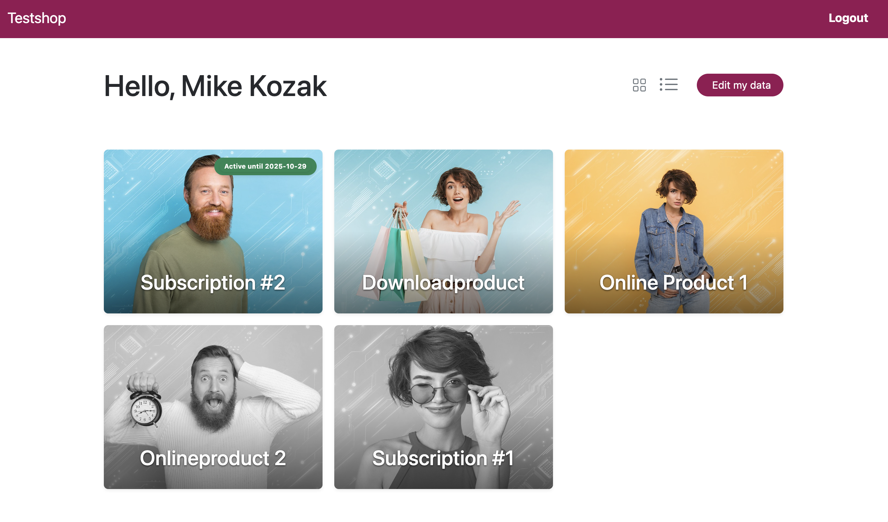
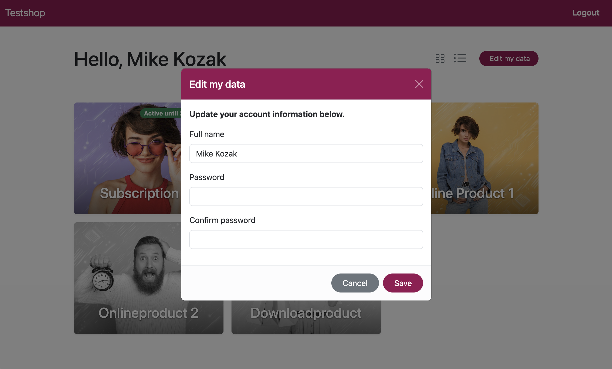
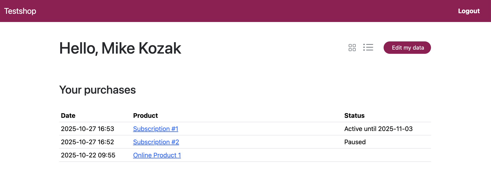
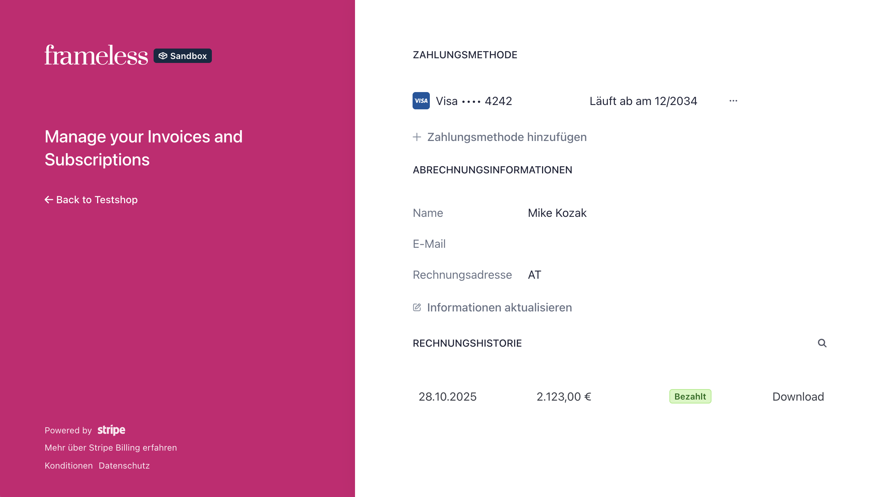

# StripePaymentLinks Customer Portal (ProcessWire)

A lightweight companion module for **StripePaymentLinks (SPL)** that adds a ready-to-use customer page at **`/account/`** plus small developer helpers (login/account/logout link & profile modal). It integrates with SPL’s own login modal and redirect flow – no duplicate auth.



---

## 1) Requirements

- **ProcessWire** 3.0.210+
- **StripePaymentLinks** (SPL) installed & configured
- **Bootstrap** available on the front-end (SPL can load it automatically)

**Product pages expected by the grid:**
- Must live on templates listed in SPL → `productTemplateNames`
- Must set the **checkbox/flag** `requires_access=1`
- (Optional but recommended) have an **Images** field  
  The grid will use the **first image** as the product thumbnail:
  - if the field doesn’t exist or is empty, the card simply has no image

---

## 2) What this module installs

- Template **`spl_account`** (fieldgroup **`fg_spl_account`**)
- Page **`/account/`** using `spl_account`
- Template file **`/site/templates/spl_account.php`** with a minimal layout that calls the portal methods  
  (You can customize this file freely.)

---

## 3) Quick start

Add a login/account/logout link anywhere in your templates:

```
$modules->get('StripePlCustomerPortal')->renderLoginLink();
```
You can also pass CSS classes or the links label via options:
```
$modules->get('StripePlCustomerPortal')->renderLoginLink(['class' => 'nav-link text-white', 'label' => 'Custom label']);
```
**Behavior**
- Logged out → shows **“Customer Login”** that opens SPL’s `#loginModal` and sets the intended redirect to `/account/`.
- Logged in on `/account/` → shows **“Logout”** (appends `?spl_logout=1`).
- Logged in elsewhere → shows **“My Account”** linking to `/account/`.

The module auto-creates `/account/`. You can link to it or place the button in your site header.

**Important: Template order for login button**

If you use `renderLoginLink()` in your template header/navigation (e.g., `_init.php` or layout file), make sure to call StripePaymentLinks' `render()` **BEFORE** rendering the header to ensure the login state is reflected correctly after Stripe checkout or magic link login:

```html  
<body>
<!-- 1) Handle SPL login FIRST (checkout/magic link) -->
  <?= $modules->get('StripePaymentLinks')->render($page); ?>

<header>
<!-- 2) NOW render header with login button (will show correct state) -->
  <?= $modules->get('StripePlCustomerPortal')->renderLoginLink() ?>
</header>
<main>
  <?= $content ?>
</main>
```

This ensures:
- After Stripe checkout → button shows **"My Account"** ✓
- After magic link click → button shows **"My Account"** ✓
- Without this order → button would show **"Customer Login"** until page reload ✗

---

## 4) Account page usage

The file `/site/templates/spl_account.php` is created for you and calls the module’s renderer. It shows:
- page header with **view switcher** and **“Edit my data”** button
- the **grid** of purchased products (and optional “not yet purchased” items)
- a profile **edit modal** (AJAX + CSRF)



Switch views (grid / table / grid-all) via querystring:

- `/account/?view=grid-all` (all products, not yet purchased products greyéd out, default used by the template)
- `/account/?view=grid` (without not yet purchased products)
- `/account/?view=table`

You can also render the header buttons anywhere:

```
$modules->get('StripePlCustomerPortal')->renderHeaderButtons('grid-all');
```

All UI elements use regular Bootstrap classes and can be styled using your preferred method.


**Table view**  


---

## 5) Stripe Billing Portal

In the **table view** of `/account/`, each purchase shows a button that opens
the **Stripe Billing Portal** for that purchase, using the stored `customer_id`
from the purchase’s `stripe_session` meta.

- No `stripe_customer_id` user field required
- Works even when purchases were made via external Stripe Payment Links
- Users can view/download invoices and manage payment methods/subscriptions

Make sure the Stripe **Billing Portal** is enabled in your Stripe Dashboard  
(Settings → Billing → Customer Portal), otherwise the portal links will not work.

Example view (Stripe Billing Portal):



---

## 6) Product data used by the grid (important)

The grid is built from the user’s SPL purchases and your product pages. For **each product**:

- **Title**: page title
- **URL**: the whole grid item (card) is linked to the page URL
- **Status badge**: only visible if product is a subscription, derived from SPL’s period/paused/canceled metadata
- **Thumbnail**: **first image** of any **`images`** field  
  → If you want images in the cards, add an **Images** field to your product templates.  
  → If an image field is missing or empty, the card renders without an image.

---

## 7) Internationalization (i18n)

All UI texts live in the module’s `i18n()` and are picked up by ProcessWire’s Language tools.
The module also overrides SPL’s `t()` **only** when the intended URL points to `/account/`, so you can present custom login modal texts for the portal flow.


---

## 8) Uninstall

- Removes `/account/` page and `spl_account` template.
- Leaves `/site/templates/spl_account.php` in place (in case you customized it).

---

## 9) License

MIT.
